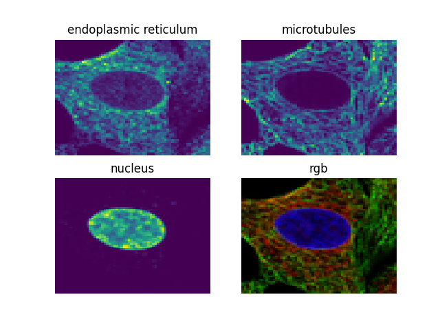

### Cell Lines Classifier

#### Project description 
The goal of this challenge is the classification of 9 regularly misidentified cell lines based on microscopy images. The classes to distinguish are PC-3, U-251 MG, HeLa, A549, U-2 OS, MCF7, HEK 293, CACO-2 and RT4.
Each sample contains at least one cell and consists of 3 seperate images showing different parts (nucleus, microtubules, endoplasmic reticulum) of the same cell.

Hint: Combining the separate images to one 3-channel-image allows to treat a sample like a regular RGB image.


Example of staining different parts of a cell:


#### Report:
• Max. 1 page report in PDF format
◦ concise description of your experiments
▪ pre-processing/input data, models/hyperparameters you tried,
final approach, post-processing,…
◦ add following info about your code:
▪ if you don’t use a notebook, state path to your main file
▪ you can use code and pre-trained models from the internet, but state
fundamental code sources (for plagiarism reasons)


Files contained: 
- `images_train.tar`: Training set (#28896 images) containing three 64x64 pixel grayscale images per sample in png format. Each sample has a unique ID.
The three images per sample represent nucleus ("_blue.png"), microtubules ("_red.png") and endoplasmic reticulum ("_yellow.png").
- `images_test.tar`: Test set #20607 images (for public + private leaderboard) in same format as training set.
- `y_train.csv`: ID of the sample and corresponding label (cell line) for the training set.
- `sample_submission.csv`: The format in which the predictions must be submitted.

```
uncompress the files and then run the below cmd for the train images to remove leading zeros
for FILE in `ls`; do mv $FILE `echo $FILE | sed -e 's:^0*::'`; done
```